Implimenting a Customizable Load Balancer

## Assignment - I

<p align="center">
      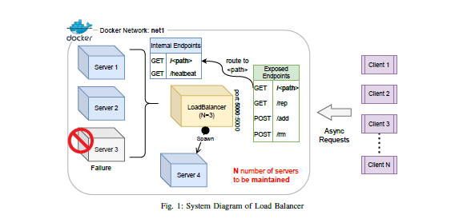
</p>

## Assignment - II

<p align="center">
      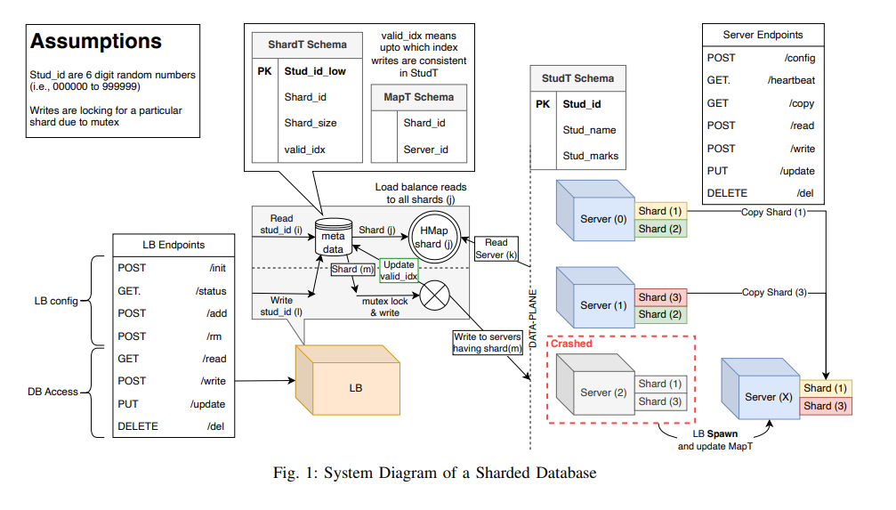
</p>

## Assignment - III

<p align="center">
      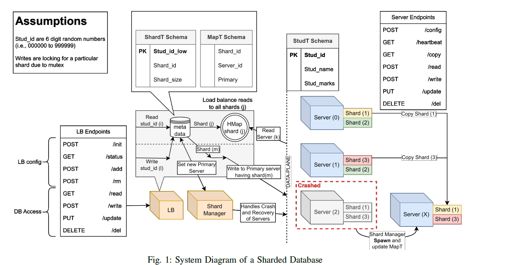
</p>

# Design

This repository implements a loadbalancer system which uses Consistent Hashmaping technnique for the the allocation of servers and client requests simulteniously further it uses the concept of virtual server of better performence. 

We use Python as a programming language and<strong> Flask </strong>module for http endpoints for the interaction over the network.For the generation of asynchronous requests <strong>asyncio aiohttp </strong> libraries are used.


<ol type="1">
 <li><strong>Load-balancer</strong> is mainly responsible for accepting asynchronous/synchronous http requests from client,distributes among the servers and other several data interpretaion execution.</li>
 The load balancer manages Stud id
→ Shard id → Server id mapping with two data tables in the metadata. The table schemas are as follows:

+  ShardT (Stud id low: Number, Shard id: Number, Shard size:Number, valid idx:Number)
+ MapT (Shard id: Number, Server id: Number)

 <li><strong>Consistent Hashmap </strong> Consistent hashing has a unique hashing structure that is circular instead of linear to avoid many shifts of data in
the event of the addition of resources to the system. Load Balancer uses consistent hashing to distribute client requests
evenly among the server instances (i.e., balancing the system load). Moreover, consistent hashing technique is also used in
distributed caching systems for better utilization of resources.</li>
Consistent hashmap for shard sh1 will contain entries for servers {Server0:sh1, Server3:sh1, Server5:sh1}. Similarly
each shard would have corresponding hashmap. Other constants for hashmap are as follows:

+ Total number of slots in the consistent hash map (#slots) = 512
+ Number of virtual servers for each server container (K) = log (512) = 9
+ Function for request mapping H(i), & virtual server mapping Phi(i, j) is what you found works best for your load
balancer implementation.

<li><strong>Server</strong> has eight endpoints "/config" endpoint initializes the sharded database in individual servers, "/heartbeat" this endpoint sends heartbeat responses upon request. The load balancer further
uses the heartbeat endpoint to identify failures in the set of containers maintained by it. "/copy" endpoint returns all the contents of a particular shard on a particular server. "/read" endpoint returns all the entries within a particular Student ID range. "/write" endpoint inserts entries into the sharded student databse. Once an entry is inserted it can be modified by the "/update" endpoint and can be removed by the "del" endpoint</li>

<li><strong>Shard</strong> The Student databse is sharded to ensure horizontal scalability.</li>
<li><strong>Shard Manager</strong><ol><li>Heartbeat Monitoring: Checks server health by periodically calling the /heartbeat endpoint.</li>
    <li>Primary Shard Selection: Selects a new primary shard when the existing one fails.</li></ol>
<li><strong>Write-Ahead Logging</strong>(WAL) mechanism for maintaining consistency among the replicas of the shards that are distributed among various servers.WAL is employed to guarantee that no data is lost and that the database can recover to a consistent state after an unexpected shutdown.</li>

</ol>
## File Structure

```
.
├── assets
│   ├── assign_1.png
│   ├── assign_2.png
│   └── assign_3.png
├── async.py
├── automateRequest.ipynb
├── docker-compose.yml
├── example.log
├── ioasync.ipynb
├── loadbalancer
│   ├── assist.py
│   ├── consistant_HASHMAP_1.py
│   ├── consistant_HASHMAP_2.py
│   ├── consistant_HASHMAP_3.py
│   ├── consistant_HASHMAP (copy).py
│   ├── consistant_HASHMAP_LP.py
│   ├── consistant_HASHMAP.py
│   ├── custom-entry.sh
│   ├── deploy.sh
│   ├── Dockerfile
│   ├── loadbalancer.py
│   ├── __pycache__
│   │   ├── assist.cpython-310.pyc
│   │   ├── consistant_HASHMAP.cpython-310.pyc
│   │   └── consistant_HASHMAP.cpython-39.pyc
│   ├── requirements.txt
│   ├── tempCodeRunnerFile.py
│   └── test_consistant_HASHMAP.py
├── Makefile
├── payload_json.txt
├── README.md
├── results
│   ├── AnalysisServerAddition_HashFunc_1.jpg
│   ├── AnalysisServerAddition.jpg
│   ├── AnalysisServerAddition_QuadraticProbing.jpg
│   ├── AnalysisServerRemove_HashFunc_1.jpg
│   ├── AnalysisServerRemove.jpg
│   ├── AnalysisServerRemove_QuadraticProbing.jpg
│   ├── Assign2_A1_Read.jpg
│   ├── Assign2_A1_Write.jpg
│   ├── Assign2_A2_Read.jpg
│   ├── Assign2_A2_Write.jpg
│   ├── Assign2_A3_Read.jpg
│   └── Assign2_A3_Write.jpg
├── server
│   ├── assist.py
│   ├── custom-entry.sh
│   ├── deploy.sh
│   ├── Dockerfile
│   ├── example.log
│   ├── __pycache__
│   │   ├── assist.cpython-310.pyc
│   │   └── server.cpython-39.pyc
│   ├── requirements.txt
│   ├── server.py
│   └── wal.py
├── shardmanager
│   ├── assist.py
│   ├── Dockerfile
│   ├── requirements.txt
│   └── shardmanager.py
├── taskAna.ipynb
├── tempDS
│   ├── assets
│   │   └── main_fig.png
│   ├── async.py
│   ├── docker-compose.yml
│   ├── ioasync.ipynb
│   ├── loadbalancer
│   │   ├── consistant_HASHMAP_1.py
│   │   ├── consistant_HASHMAP_2.py
│   │   ├── consistant_HASHMAP_3.py
│   │   ├── consistant_HASHMAP (copy).py
│   │   ├── consistant_HASHMAP_LP.py
│   │   ├── consistant_HASHMAP.py
│   │   ├── deleteMe.py
│   │   ├── Dockerfile
│   │   ├── loadbalancer.py
│   │   ├── __pycache__
│   │   │   └── consistant_HASHMAP.cpython-39.pyc
│   │   ├── requirements.txt
│   │   ├── tempCodeRunnerFile.py
│   │   └── test_consistant_HASHMAP.py
│   ├── Makefile
│   ├── README.md
│   ├── results
│   │   ├── AnalysisServerAddition_HashFunc_1.jpg
│   │   ├── AnalysisServerAddition.jpg
│   │   ├── AnalysisServerAddition_QuadraticProbing.jpg
│   │   ├── AnalysisServerRemove_HashFunc_1.jpg
│   │   ├── AnalysisServerRemove.jpg
│   │   └── AnalysisServerRemove_QuadraticProbing.jpg
│   └── server
│       ├── Dockerfile
│       ├── requirements.txt
│       ├── server_2.py
│       ├── studTable.db
│       └── table1.py
└── Untitled-1
```
# Assumptions
## Assignment - I

+ For the server ids we have use six digit random numbers which servers the purpose of non cluster allocation of virtual servers.
+ For removing servers, if the no.of servers are more than the length of Hostname then random servers are chosen and removed.
+ For analisys part when servers are increasing, we put a 10 second halt.
+ Statistically, K = log (M) (K = no. of virtual server, M = no. of slots.) virtual servers work best to distribute the load across the
physical server instances equally.
+ In case of faliure of server, we have manually down the server.

## Assignment - II

+ We take a random six digit server ID where ever there is input of format Server[n].

+ For removing servers, if the no.of servers are more than the length of Hostname then random servers are chosen and removed.

+ the "/init" endpoint of the loadbalancer is used once only at the begining or after downscaling the servers to 0.

+ As metioned in Task 4: (SubTask-A2)- while increasing no of Shard replicas  to 7. We have made the no servers as constatant ,according to that we have distribued the shard over the available servers.

Here we took default configauration as per Task 2:
```
    {
        "N":6
        "schema":{"columns":["Stud_id","Stud_name","Stud_marks"],
        "dtypes":["Number","String","String"]}
        "shards":[{"Stud_id_low":0, "Shard_id": "sh1", "Shard_size":4096},
        {"Stud_id_low":4096, "Shard_id": "sh2", "Shard_size":4096},
        {"Stud_id_low":8192, "Shard_id": "sh3", "Shard_size":4096},
        {"Stud_id_low":12288, "Shard_id": "sh4", "Shard_size":4096}]"servers":{"Server0":["sh1","sh2"],
        "Server1":["sh3","sh4"],
        "Server3":["sh1","sh3"],
        "Server4":["sh4","sh2"],
        "Server5":["sh1","sh4"],
        "Server6":["sh3","sh2"]}
    }
```
# Assignment -III
+ <strong>WAL (Write-Ahead Logging)</strong> log files, namely serverLog.log and serverQuery.log, are where both our primary database servers and secondary shards write changes. The primary server replicates these changes to the secondary shards before committing the data. Once the secondary shards acknowledges the receipt of the changes, the primary server commits the changes to maintain consistency across both servers.
+ <strong>/rm</strong> for removing servers, if the no.of servers are more than the length of Hostname then random servers are chosen and removed. If the primary shards fails, then a new primary is chosen from the replicated shards having the most updated log entries. As soon as the downed database server is up, it copies all the shards from the primary shards. 


# Challenges

## Assignment - I

+ Sending the request to the load-balancer and tracking the server load was quite challenging.
+ However we have noticed that a large number of server container allocation might affect the performence of the system.
+ In real case scenario servers may get down for various reasons but in our case servers are running on docker container it is challenging to down them automatically. 

## Assignment - II

+ As metioned in Task 4: (SubTask-A2)- while increasing no of Shard replicas  to 7, a colflict will arrise because if we want to distributed 7 shard replicas of  4 shard (Default configauration as per Task 2) then total no of replicas will be 4x7 = 28 which not divisable by 6(Available servers). The ideal no of distribution value comes near 4.3. So we have takes 4 no of replicas to each server to resolve this conflict.

## Assignment -III
+ maintaining WAL files 

# Prerequisites

### 1. Docker: latest [version 20.10.23, build 7155243]

    sudo apt-get update

    sudo apt-get install \
        ca-certificates \
        curl \
        gnupg \
        lsb-release

    sudo mkdir -p /etc/apt/keyrings
    curl -fsSL https://download.docker.com/linux/ubuntu/gpg | sudo gpg --dearmor -o /etc/apt/keyrings/docker.gpg

    echo \
    "deb [arch=$(dpkg --print-architecture) signed-by=/etc/apt/keyrings/docker.gpg] https://download.docker.com/linux/ubuntu \
    $(lsb_release -cs) stable" | sudo tee /etc/apt/sources.list.d/docker.list > /dev/null

    sudo apt-get update

    sudo apt-get install docker-ce docker-ce-cli containerd.io
    

### 2. Docker-compose standalone [version v2.15.1]
    sudo curl -SL https://github.com/docker/compose/releases/download/v2.15.1/docker-compose-linux-x86_64 -o /usr/local/bin/docker-compose
    
    sudo chmod +x /usr/local/bin/docker-compose
    
    sudo ln -s /usr/local/bin/docker-compose /usr/bin/docker-compose

### 3. MYSQL:8.0
    FROM mysql:8.0-debian
    COPY deploy.sh /always-initdb.d/ #here the flask app deploy script is copied
    COPY . /bkr
    WORKDIR /bkr

    RUN apt-get update
    RUN apt-get install -y python3
    RUN apt-get install -y python3-pip

    RUN pip install --upgrade pip
    RUN pip install -r requirements.txt

    ENV MYSQL_ROOT_PASSWORD="abc" #host=’localhost’, user=’root’,password=’abc’

    EXPOSE 5000

# Installation Steps
### Deploy Sever
#### Build the Server Docker Image

    cd ./server/ && sudo docker build -t server .

### Deploy Loadbalancer
#### Build the LoadBalancer Docker Image
    make build
#### Run the LoadBalancer Docker Image
    make up


### Remove/Stop Loadbalancer/Server
    make down
    
### Remove/Stop Loadbalancer/Server & Restart Container
    make restart


### To send requests
    automateRequest.ipynb

# Testing
## Assignment - I
Initially, 10,000 asynchronous requests were sent to the load balancer, which distributed them among the existing three servers. Subsequently, the number of servers was increased by one, and for each iteration, another 10,000 asynchronous requests were sent to the load balancer. Upon analyzing the load balancer's performance, it was observed that it efficiently distributed the requests, effectively managing the network load. 
The bar plot visually depicts the average number of requests handled by each server.
Test results are as follows:
<table>
      <tr>
        <td><strong>Increasing no of Servers by one</strong></td>
        <td><strong>Decreasing no of Servers by one</strong></td>
  </tr>
  <tr>
    <td>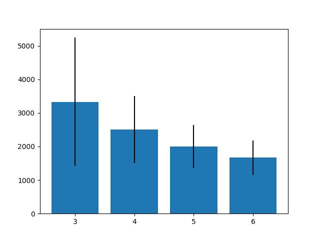</td>
<td>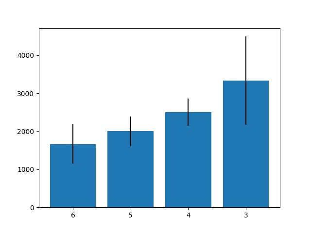</td>
  </tr>
</table>

## Assignment - II
To analyze the performance of the developed distributed database. We have designed following testing enviroment.
### Analysis - I

The read and write speed for 10000 writes and 10000 reads in the default configuration given in task 2.
<p align="center">
      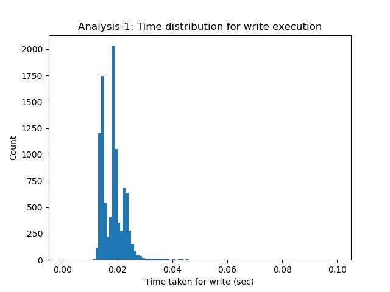
</p>
<p align="center">
      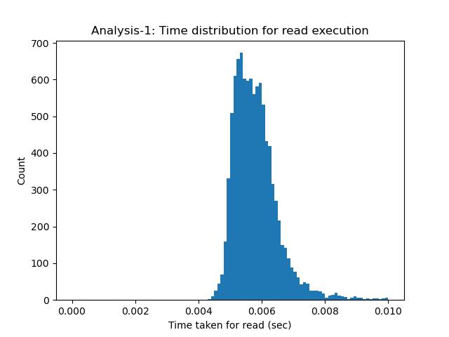
</p>

### Analysis - II
+ Increased the number of shard replicas (to 7) from the configuration (init endpoint).
+ The write speed down for 10000 writes and read speed up for 10000 reads.
<p align="center">
      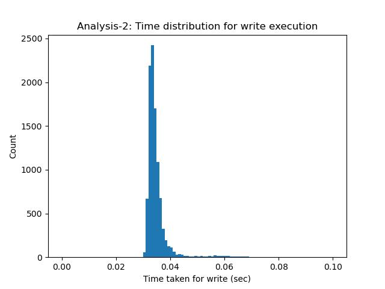
</p>
<p align="center">
      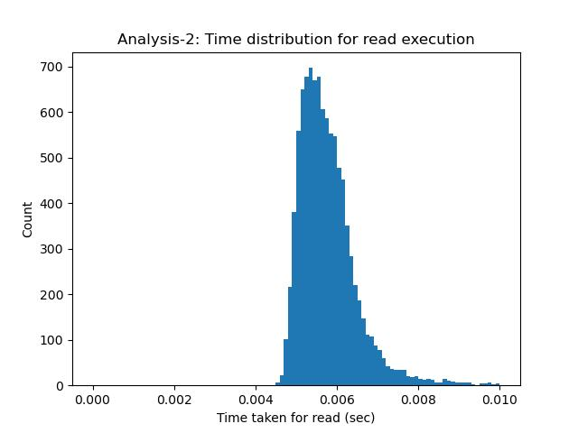
</p>

### Analysis - III
+ Increased the number of Servers (to 10) by adding new servers and increased the number of shards (shard to 6, shard replicas to 8). 
+ The write speed up for 10000 writes and read speed up for 10000 reads.

<p align="center">
      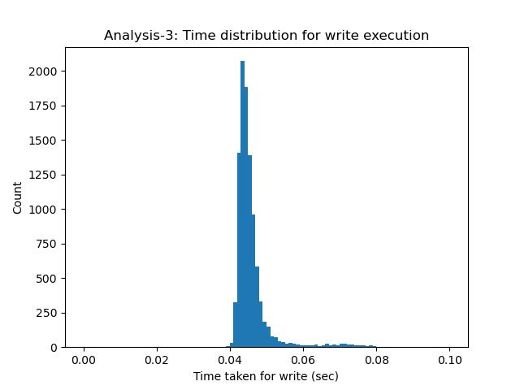
</p>
<p align="center">
      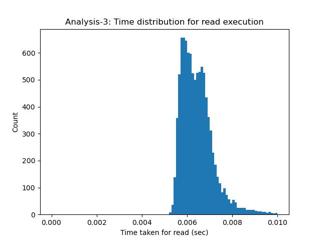
</p>

### Analysis - IV
#### Liveness and Correctness :
    def replica_status():
    
          while True:
              ####################Respwn Method 1###############################
              global schema,replicas
              for replica in replicas:
      
                  # alive = None
                  alive = os.system(f"ping -c 1 {replica}")
                  logger.info(f"Livenness of {replica} is {alive}, Available replica {replicas}")
                  if alive :
                      logger.info(f"{replica} is down... Trying to Re-initialize ...")
                      res = os.popen(f"sudo docker rm {replica}")
                      shradinReplica = queryHandler.getShardsinServer(replica)
                      res=os.popen(f"sudo docker run --name {replica} --network net1 --network-alias {replica} -e 'SERVER_ID={replica}' -d server:latest").read()
                      # res=os.popen(f"sudo docker restart {replica}").read()
                      time.sleep(20)
      
                      logger.info("I am waiting for server to Re-initilize....... ")
                      logger.info(f"Intialized server:{replica}")
                      # shardsinserver = queryHandler.getShardsinServer(server)
                      logger.info(f"shards list inside server : {shradinReplica}")
                      serverPayload_json = {
                          "schema": schema,
                          "shards": shradinReplica
                      }
                      logger.info(f"Server paylod at config: {serverPayload_json}")
                      print(serverPayload_json)
                      tries = 0
                      print("Calling config for ",replica)
                      logger.info(f"Calling config for {replica}")
                  
                      try:
                          url = f"http://{replica}:5000/config"
                          res=requests.post(url,json=serverPayload_json).json()
                          logger.info(f"Response from {replica} is :{res}")
                      except Exception as e:
                          logger.info(f"The routed {replica} is not yet Initialized, Retrying ....{tries}")
      
                      shardsToCopy = queryHandler.getShardsinServer(replica)
                      for shard in shardsToCopy:
                          serverToCopyFrom = select_random_elements(queryHandler.whereIsShard(shard),[replica],len(queryHandler.whereIsShard(shard))-1)
                          copyRES = {}
                          for oldserver in serverToCopyFrom:
                              logger.info(f"Starting data migration from {oldserver} to new server {replica}")
                              copyJSON = {
                                  "shards" : [shard]
                              }
                              url = f"http://{oldserver}:5000/copy"
                              copyRES = requests.get(url,json=copyJSON).json()
                              # logger.info(f"Copy endpoint of {oldserver} gave response {copyRES}")
                              logger.info(f"Fetched data from {oldserver}: {copyRES}")
                              if copyRES["status"] == "success":
                                  break
                          logger.info(f"Starting Data migration from {oldserver} of {shard} for {replica}")
                          data = copyRES[shard]
                          writeJSON ={
                              "shard": shard,
                              "curr_idx" : 0,
                              "data": data
                          }
                          logger.info(f"Json for wrtting the data to newly added {replica}:{writeJSON}")
      
                          url = f"http://{replica}:5000/write"
                          writeRES = requests.post(url, json=writeJSON).json()
      
                          logger.info(f"Response from {replica} is : {writeRES}")
                          logger.info(f"Copied data of {shard} from {oldserver} to {replica}")
                  ################Remove Unwanted container or respwn previous container automatically #############################
              extraContainerOut = os.popen("sudo docker ps --format '[[ .Names ]]'").read().split("\n")
              extraContainerOut = extraContainerOut[:len(extraContainerOut)-1]
              for container in extraContainerOut:
                  if container not in replicas and container=="loadbalancer":
                      os.system(f"sudo docker stop {container} && sudo docker rm {container}")
              time.sleep(5)
      


    ############### Calling Server thread ###############
    server_thread = threading.Thread(target=replica_status)
    server_thread.start()
# Edge-Cases
## Assignment - II /Assignment - III

### Server

+ <strong> /config: </strong> Create tables of the specified shard name in ShardDB database of respective server if they do not already exist. Sanity checks to ensure correct format of payload is received.
+ <strong> /copy: </strong> Sanity checks to ensure correct format of payload is received. Return error if any one of the shardsis absent in the server. Return failure if all shards are empty in the server in which case there is no data to return 
+ <strong> /read: </strong> Sanity checks to ensure correct format of payload is received. Sanity check to ensure lower bound given is less than the given upper bound.
+ <strong> /write: </strong> Sanity checks to ensure correct format of payload is received. Student Id is used a primary key in the database to garantee that Id is unique field.
+ <strong> /update: </strong> Sanity checks to ensure correct format of payload is received. Added check to make sure that the entry to be updated exists or not.
+ <strong> /delete: </strong> Sanity checks to ensure correct format of payload is received. Added check to handle case of deleting a non existant entry.

### Loadbalancer

+ <strong> /add: </strong> Handled the case of adding servers with pre existing shards in which case data in these shards is copied from other servers.

+<strong> /rm: </strong> Handled case where down scaling servers may lead to 

### shardManager 
+<strong>detect_and_update()</strong> If primary server for a shard is removed then also the shard manager should trigger the primary selection from available servers for that shard.

# Contact Me

This is Assignment 1 & 2 of CS60002: Distributed Systems course in IIT Kharagpur, taught by [Dr. Sandip Chakraborty](https://cse.iitkgp.ac.in/~sandipc/).
